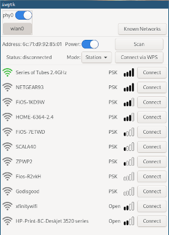

## About
iwgtk is a lightweight, graphical wifi management utility for Linux. It is used to control
iwd, with supported functionality similar to that of iwctl. It is particularly useful in
a system where iwd is being used as a standalone network management daemon (i.e., without
NetworkManager).



## Usage
* Launch application window: `iwgtk`
* Run in the background with indicator icons: `iwgtk -i`

## Dependencies
* iwd
* gtk3

### i3wm

Since i3wm only supports the Xembed API but not the StatusNotifierItem tray icon API, a compatibility layer is required (see [#19](https://github.com/J-Lentz/iwgtk/issues/19#issuecomment-970804494)).

[snixembed](https://git.sr.ht/~steef/snixembed) is an option for this and can be installed on arch with `yay -S snixembed-git`

## Installation
To build iwgtk and install it to /usr/local, run:

```
make
sudo make install
make clean
```

To install to /usr instead of /usr/local use:
```
sudo make prefix=/usr install
```

## License
Copyright 2020-2021 Jesse Lentz <jesselnz@gmail.com> and contributors (see below)

iwgtk is licensed under the GPL version 3 or later.

All icons, including the application icon, tray icons, and icons within the GUI, are from
the "wifi states" collection by i cons from the Noun Project. These icons are licensed
under the Creative Commons BY license.
<https://thenounproject.com/iconsguru/collection/wifi-states/>

## Contributors
* Jove Yu
* Jaron Viëtor (Thulinma)
* tinywrkb
* Érico Nogueira Rolim
