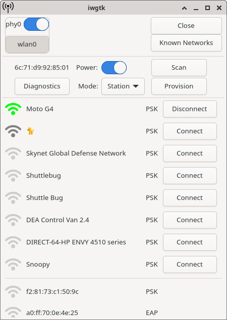

## About
iwgtk is a lightweight, graphical wifi management utility for Linux. It controls
iwd, with supported functionality similar to that of iwctl. It is particularly
useful in a system where iwd is used as a standalone network management daemon
(i.e., without NetworkManager).



## Usage
Launch the application window: `iwgtk`

Launch the indicator daemon: `iwgtk -i`

A systemd unit file to start the indicator daemon is provided. If your distro
uses systemd and your desktop environment supports systemd's
`graphical-session.target` unit, you can start and enable iwgtk's indicator
daemon with the following command:
```
systemctl --user enable iwgtk.service --now
```

## Dependencies
* iwd >=1.28
* gtk4
* adwaita-icon-theme (or an equivalent icon package)

## Installation
To build iwgtk and install it to /usr/local, run:

```
make
sudo make install
make clean
```

To install to /usr instead of /usr/local use:
```
sudo make PREFIX=/usr install
```

## Troubleshooting

### The indicator icon doesn't show up
iwgtk's icon should show up on any system tray which supports the
StatusNotifierItem API. If your tray only supports the older XEmbed API, then a
compatibility layer such as [snixembed](https://git.sr.ht/~steef/snixembed) is
required.

The following trays support StatusNotifierItem:
* KDE Plasma
* swaybar
* xfce4-panel (*must be built with the optional libdbusmenu-gtk3 dependency*)

The following trays only support XEmbed, and require a compatibility layer:
* AwesomeWM
* i3bar

### iwgtk and iwctl only work with superuser privileges
As of iwd 1.23, membership in either the `netdev` or `wheel` group is required
to control iwd:
```
# usermod -a -G netdev YOUR_USER_ACCOUNT
```
If no `netdev` group exists on your system, then you'll need to create it prior
to running the above `usermod` command:
```
# groupadd netdev
```

## License
Copyright 2020-2022 Jesse Lentz <jesse@twosheds.org> and contributors (see below)

iwgtk is licensed under the GPL version 3 or later.

The application icon is from the [wifi
states](https://thenounproject.com/iconsguru/collection/wifi-states/) collection
by [i cons](https://thenounproject.com/iconsguru/) from the Noun Project. This
icon is licensed under the [Creative Commons BY
license](https://creativecommons.org/licenses/by/3.0/us/legalcode).

## Contributors
* Jove Yu
* Jaron Viëtor (Thulinma)
* tinywrkb
* Érico Nogueira Rolim
* VaguePenguin
* Andrew Benson
* Alex Piechowski (grepsedawk)
